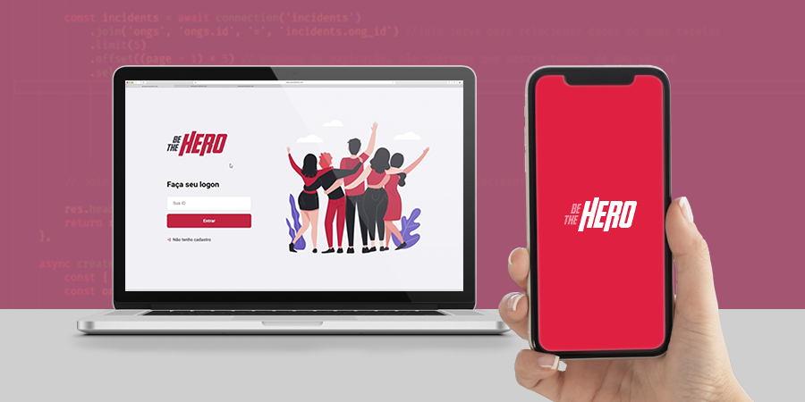

<h2 align="center">
    
</h2>

 

    

<h4 align="center">
  🚀 Semana OmniStack 11.0
</h4>

  

  :heart: <a href="#heart-o-projeto">O projeto</a>&nbsp;&nbsp;&nbsp;|&nbsp;&nbsp;&nbsp;
  :computer: <a href="#computer-tecnologias">Tecnologias</a>&nbsp;&nbsp;&nbsp;|&nbsp;&nbsp;&nbsp;
  :arrow_forward: <a href="#arrow_forward-iniciando-a-aplicação"> Iniciando a aplicação </a>
    

 

## :heart: O projeto

Na semana OmniStack 11.0 da Rocketseat desenvolvemos o projeto Be The Hero, que tem como objetivo permitir que ONG's publiquem e divulguem seus casos que precisam de algum auxílio financeiro, para que outros possam ajudar. 
   
A ONG cria sua conta na aplicação web e cadastra o casos que deseja preenchendo os campos necessários. 
Através da aplicação mobile, os usuários poderão ver casos das ONG's e entrar em contato via e-mail ou Whatsapp, caso possua o interesse de ajudar.

 

## :computer: Tecnologias

Tecnologias utilizadas na aplicação
- [React](https://reactjs.org)
- [Node.js](https://nodejs.org/en/)
- [Express](https://expressjs.com/pt-br/)
- [Knex](http://knexjs.org/)
- [SQLite](https://www.sqlite.org/index.html)

- [React Native](https://facebook.github.io/react-native/)
- [Expo](https://expo.io/)

 

## :arrow_forward: Iniciando a aplicação

Clone o repositório para sua máquina usando o comando `git clone https://github.com/juliannevolotao/nlw-be-the-hero.git` no local desejado através do terminal. Em seguida acesse a pasta do projeto com o comando `cd nlw-be-the-hero`.

  

### :game_die: Backend 

 

**1.** Acesse a pasta backend da aplicação pelo terminal `cd backend`;

**2.** Estando dentro na pasta, execute o comando `npm install` ou `yarn install`;

**3.** Após a finalização da instalação, execute `npx knex migrate:latest`, para que o banco de dados possa ser criado;

**4.** Em seguida rode a aplicação com `npm start` ou `yarn start`.

  

### :pencil2: Frontend

  

**1.** Acesse a pasta frontend da aplicação. `Se estiver na pasta raíz execute cd frontend pelo terminal`;

**2.** Estando dentro da pasta execute o comando `npm install` ou `yarn install`;

**3.** Em seguida rode a aplicação com `npm run start` ou `yarn start`.

  

### :iphone: Mobile 

 

**1.** Acesse a pasta mobile da aplicação. `Se estiver na pasta raíz execute cd mobile pelo terminal`;

**2.** Estando dentro da pasta execute o comando `npm install` ou `yarn install`;

**3.** Em seguida rode a aplicação com `npm start` ou `yarn start` e então aparecerá um QRCode para que seja possível abrir a aplicação no aplicativo [Expo](https://expo.io/).

 
 

> **Obs.:** Para o funcionamento do Frontend e do Mobile, é necessário que o Backend esteja funcionando!

<h4>

___

<h5 align="center">
  :rocket: Semana OmniStack 11.0 desenvolvida por Julianne Volotão.
</h5>

